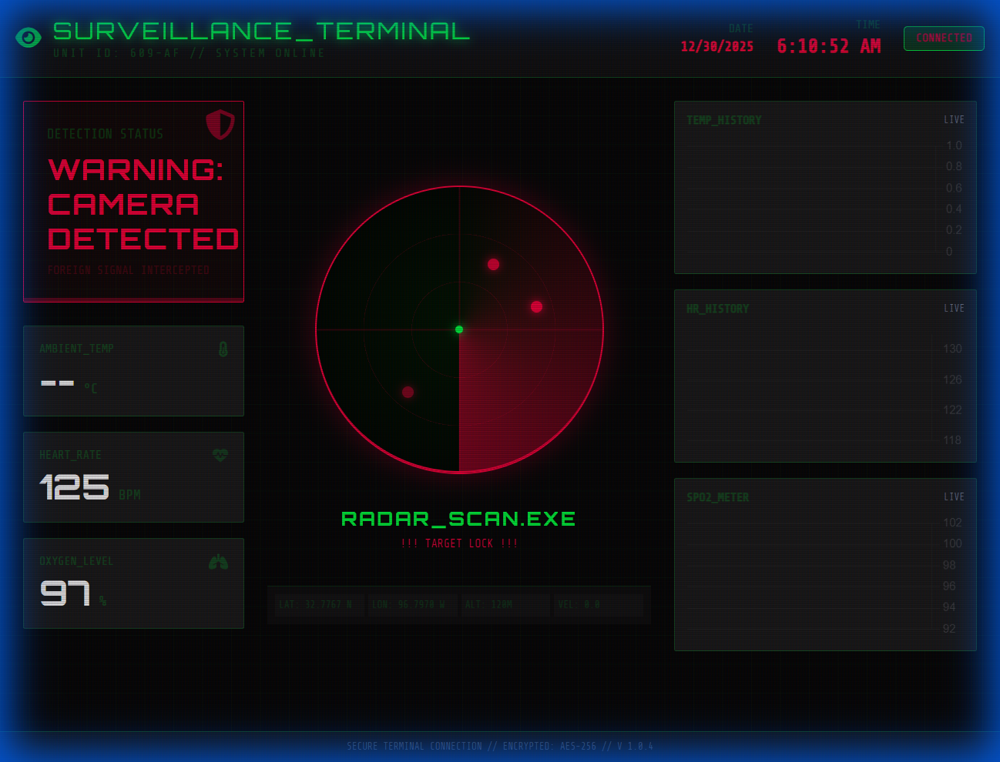
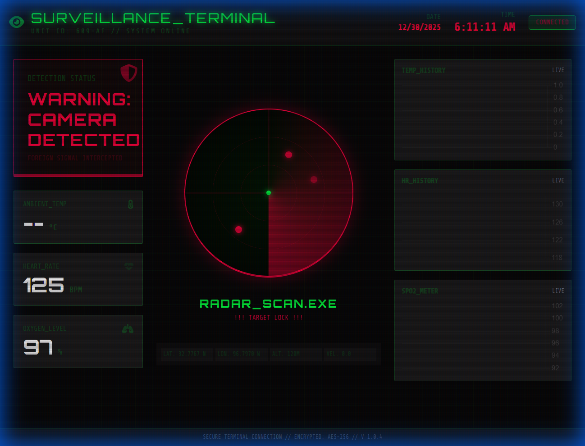

# Hidden Camera Detection System

A high-tech, cyber-themed surveillance dashboard for detecting hidden cameras. This project features a real-time radar scanner, live sensor graphs, and geolocation tracking, all styled with a "Stealth/Hacker" aesthetic.

## Features

-   **Cyberpunk UI**: Dark mode, neon accents, and CRT scanline effects.
-   **Real-Time Radar**:
    -   Rotary scanner animation.
    -   **Target Lock**: Displays a single red blip and visual alert when a camera is detected.
-   **Live Sensor Data**:
    -   Visualize Heart Rate, SpO2, and Ambient Temperature via Chart.js.
    -   Data is streamed in real-time from Firebase Realtime Database.
-   **Geolocation Tracking**:
    -   Uses browser Geolocation API to display Latitude, Longitude, Altitude, and Velocity.
-   **Responsive Design**:
    -   Mobile-optimized layout (hides non-essential status indicators on small screens).
    -   Full desktop dashboard experience.

## Screenshots

### Dashboard Overview (Normal State)

### Detection Alert (Active State)
*Simulated detection showing the red alert mode and radar target lock.*

## Installation & Usage

1.  **Clone or Download** the repository.
2.  Open `index.html` in any modern web browser.
3.  **Permissions**:
    -   Allow **Location Access** when prompted to enable the Geolocation features.
4.  **Data Source**:
    -   The application is pre-configured to listen to a public Firebase Realtime Database demo instance.
    -   To use your own data, edit the `firebaseConfig` section in `index.html`.

## Technologies

-   **HTML5 / JavaScript (ES6)**
-   **Tailwind CSS** (via CDN)
-   **Chart.js** (via CDN)
-   **Firebase SDK** (Web)
-   **FontAwesome** (Icons)
